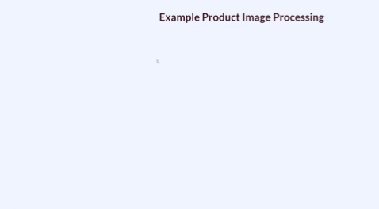

# Project Description

## **Logo IDing**: ***Sifting Through Pixels for Brand Identification***

#### Project Summary

This is a project I did as an Insight Data Science Fellow from May to mid-July, 2020 at the Toronto location. The aim of the project is to use computer vision to identify the brand of a probduct in an online image of the product. This can enable us to track the trend of brands, generates insights on performance of products and even proivde investment advice based on observed trends. The three key components are the *object detector (Yolov4)*, *feature extractor (NasNetLarge)*, and the *similarity measure (cosine similarity) for brand matching*.

#### Folder Structure

- src
  - static
    - assets
      - brand
      - dist
      - img: contains static files for the flask app
  - templates
  - yolo_v4: contains the weights (too big for github upload). [Email](mailto:ezeme.okwudili@gmail.com "ezeme.okwudili@gmail.com") me if you need the pretrained weights to initialize your model or to run this model.
  - app source code and other python utility files for data scraping, cleaning and annotation.
  - notebooks: contains the jupyter notebook for model training and exploring the data.

Please check the pipfile for required python packages. [Opencv 4.4.0](https://docs.opencv.org/master/d2/de6/tutorial_py_setup_in_ubuntu.html) was installed from source because Yolov4 is not yet included in the prebuilt binaries. If you are viewing this repo when opencv 4.4.0 or higher has been officially released, then there is no need for installing from source. Just use the official opencv-python install from pypi.

#### Usage

1. **Training**: Clone the repo and use [Yolov4](notebooks/YOLOv4_Darknet.ipynb) jupyter notebook to train a new Yolov4 object detector using darknet. The notebook is self explanatory but you do need your own dataset as the sample one I provided is only 1000 images or so. You can contact the guys that own Logos in the Wild Dataset for a copy of the training data and or download some sample product images and annotate using microsft VoTT annotation tool. When you are done training, copy the weight and cfg file to any location of your choice and use them to setup the opencv inference detector in the app file source detector function. Remember that you need opencv 4.4.0 installed along with the python packages.
2. **Inference**: For inference or testing without training afresh, clone the repo, use the pipfile to install the python packages along with a minimum of opencv 4.4.0 and shoot me an email to get the cfg and weight files. Place the weight and cfg files inside the src/yolo_v4 folder and start the flask app from the parent folder using the syntax below:

        python src/app.py

    Follow the web address displayed by the flask app to test the web app. If you want to add more logos to the logo bank, uncomment the commented portion of the feature extractor file, edit the dictionary with the brand and img name of the logo you want to add and run the following from the terminal:

        python src/feature_extractor.py

    Similar to the Yolov4 object detector, a threshold can be added to the brand matching function to remove low confidence matching.

